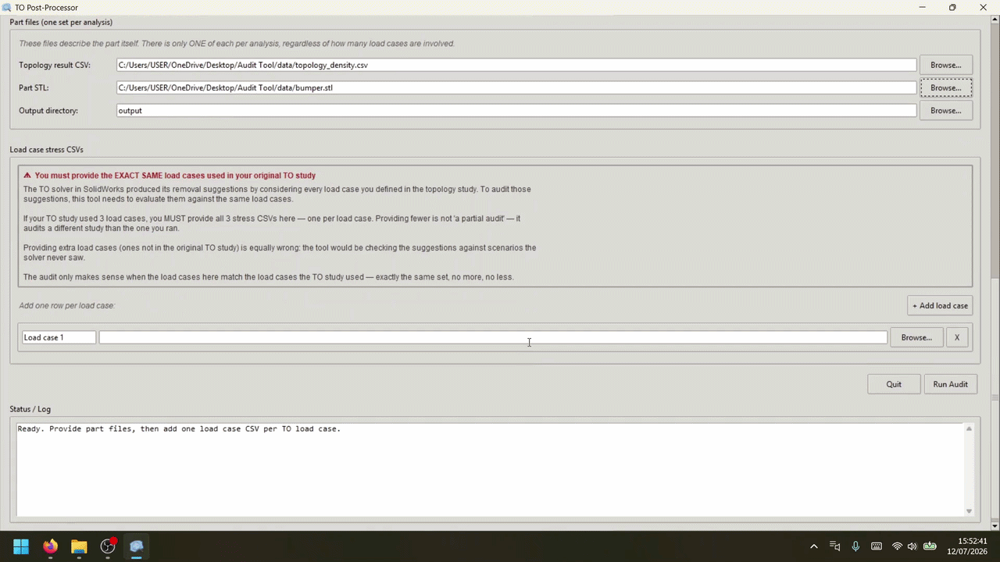

# TO Post-Processor Audit Tool

A Python tool that audits SolidWorks topology-optimisation output against four orthogonal engineering filters — Manufacturing, Structural, Functional, and Complexity — and flags solver-proposed removals that would fail in the real world.



## The problem this solves

Topology-optimisation solvers (SolidWorks, Ansys, Altair, and others in the SIMP family) minimise mass under stress and displacement constraints. They do not know whether their proposed removals are manufacturable, whether they weaken load paths outside the local stress field, or whether they compromise design features the part needs to function.

The consequence: an engineer takes the raw solver output and spends hours manually rejecting most of it. Most of those rejections are obvious — the same handful of structural and manufacturing reasons, recognisable on sight to anyone trained.

This tool automates that obvious-rejection pass. It takes the part geometry, the topology-optimisation output, and the per-node stress data the solver used, and applies four engineering criteria the solver was not given. The engineer reviews a shorter, sensible-by-default list instead of the raw solver suggestion.

The tool is a **negative filter**. It identifies removals to reject. It does not approve removals — anything "not flagged" is the engineer's responsibility to verify. There is no permissiveness dial by design; a tunable audit would launder bad output into validated-looking bad output.

## What the four filters do

- **Manufacturing** — checks each removal against single-action injection-moulding constraints (undercuts, through-holes, tunnels into structural material, mesa-and-depression patterns). Includes a geometric tunnel detector for elongated cuts with asymmetric endpoint surroundings.
- **Structural** — three sub-checks: is the region itself in critical stress (FoS below threshold), does it sit next to a critical-stress region whose load path it serves, and does it sit at a junction where multiple structural members meet (via PCA on nearby high-density material).
- **Functional** — checks against manually-defined keep-out regions from an optional `functional_zones.json` file. Most parts do not need this; the complexity filter handles feature protection automatically.
- **Complexity** — identifies geometrically distinguished regions (sensor pockets, mounting interfaces, structural junctions) without manual annotation, by exploiting the mesh-refinement and density-transition signatures features leave in SIMP output.

Full architectural and mathematical detail in the accompanying report on ResearchGate.

## Two ways to run

The tool ships as either a pre-built Windows executable or Python source. The executable is downloaded separately from the Releases page; the source is in this repository.

### Option 1 — Windows executable (fastest)

1. Go to the **Releases** tab of this repository.
2. Download the latest `TO.Audit.Tool.exe`.
3. Place it in the same folder as the `data/` directory from this repo.
4. Double-click it. First launch takes 10–20 seconds while Windows unpacks the bundle.

No Python installation, no virtual environment, no dependencies to install. Everything is bundled inside the exe (~194 MB).

If Windows SmartScreen warns about an unsigned executable, click "More info" → "Run anyway". The exe is built locally with PyInstaller and isn't signed with a commercial code-signing certificate.

### Option 2 — Run from source (any OS)

Requires Python 3.10+.

```bash
git clone https://github.com/bakunstephan/to-postprocessor-audit.git
cd to-postprocessor-audit

python -m venv .venv
# On Windows (Command Prompt):
.venv\Scripts\activate
# On Windows (PowerShell):
.venv\Scripts\Activate.ps1
# On macOS / Linux:
source .venv/bin/activate

pip install -r requirements.txt

python gui.py
```

If PowerShell blocks the activation script with an execution-policy error, run this once first:

```powershell
Set-ExecutionPolicy -ExecutionPolicy RemoteSigned -Scope CurrentUser
```

## Using the tool

The GUI has two input sections:

- **Part files** (top): the topology density CSV, the STL, and the output directory.
- **Load case stress CSVs** (bottom): one stress CSV per load case used in the original TO study. The bumper case study uses three (frontal, side_a, side_b).

The load cases here must exactly match the load cases used in the original TO study — no more, no less. Providing fewer audits a different study than the one that ran; providing extra checks against scenarios the solver never saw.

The GUI's "How to export each file from SolidWorks" button walks through the export process, including the fast Solid-Body probe method that avoids the slow per-face selection.

Click **Run Audit**. On completion:

- Text report → `output/post_processor_report.txt`
- JSON report → `output/post_processor_results.json`
- Four screenshots (isometric, top, front, side) → `output/screenshots/`
- Interactive 3D viewer opens — drag to rotate, wheel to zoom, `q` to close.

## Expected output on the bumper case study

The bumper case study included in `data/` reproduces the results from the report. Running the tool on it flags all 28 detected removal regions for rejection. Breakdown:

- 12 regions failed structural alone (predominantly 3D-corner rib-junctions, plus three FoS-adjacency rejections)
- 8 regions failed structural + manufacturing (through-holes, elongated channels, and isolated mesa-and-depression patterns — all also sitting at structural junctions)
- 7 regions failed structural + manufacturing + complexity (central housing cluster and wing-mounting bore regions)
- 1 region failed structural + complexity without triggering manufacturing

The functional filter produces no rejections on the bumper because no manual zones are provided — the complexity filter catches feature protection automatically. No pure red (manufacturing only) or cyan (complexity only) appears in the 3D view because every manufacturing or complexity catch is also caught by structural.

The pre-generated report and screenshots for this run are in `output/` so you can inspect the tool's output without running anything.

## Design notes

- **No permissiveness dial by design.** Spatial parameters (adjacency radius, complexity spread radius, neighbourhood radius) are auto-calibrated at runtime from the input mesh statistics. Filter thresholds (FoS 1.5, 1.3 sigma complexity cutoff, 0.5% adjacency-support count, 15× mesh-spacing factor for structural adjacency) are hard-coded.
- **The tool prints a calibration caveat** in both the GUI log and the text report after every run, naming which thresholds are absolute (calibrated against the bumper case mesh) versus auto-scaling. The 20-element junction-detector threshold and the 2.5:1 / 3.0× tunnel-detector thresholds are absolute and may need re-calibration on parts with very different mesh scales.
- **Full details** on calibration, limitations, and planned future work in the report.

## Troubleshooting

- **Windows SmartScreen warning on the exe.** Click "More info" → "Run anyway". Unsigned PyInstaller builds trigger this by default.
- **Exe takes 10–20 seconds to launch.** Normal. PyInstaller has to unpack the bundled Python + VTK + PyVista to a temporary folder on first run. Subsequent launches are faster.
- **`ModuleNotFoundError: No module named X`** (source run). The virtual environment isn't activated. Re-activate it before running the tool.
- **`python: command not found`** or **`py: command not found`**. Python isn't installed or isn't on your PATH. Install from python.org and tick "Add Python to PATH" during installation.
- **PyVista 3D viewer fails to open.** Update your graphics drivers. PyVista uses VTK which needs a working OpenGL stack. On Linux without a GUI, run with `xvfb-run python gui.py`.
- **GUI runs but Run Audit produces no output.** Check the Status/Log pane at the bottom of the GUI. Common causes: a CSV path pointing to a file that doesn't exist, or the SolidWorks export uses unexpected column names.

## Report

Full technical report, including architecture, algorithm details, bumper case study, and future work:

Bakun, S. (2026). *Mechanical Design and Topology-Optimisation Audit of a Domestic Cleaning Robot*. Preprint, University of Salford. DOI: [10.13140/RG.2.2.31046.64327](https://doi.org/10.13140/RG.2.2.31046.64327)

## License

- **Code:** GNU Affero General Public License v3.0. See `LICENSE`.
- **Report:** Creative Commons Attribution 4.0 International (CC BY 4.0).

## Author

Stephan Bakun. MSc Robotics and Automation, University of Salford, 2026.
- GitHub: [bakunstephan](https://github.com/bakunstephan)
- ResearchGate: [Stephan Bakun](https://www.researchgate.net/profile/Stephan-Bakun-2)
